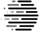

[](https://opensource.org/licenses/MIT)

<a href="https://www.linkedin.com/pulse/microsoft-harvards-institute-quantitative-social-science-john-kahan/"></a>
## SmartNoise Samples: Differential Privacy Examples, Notebooks and Documentation
See also the accompanying [SmartNoise SDK repository](https://github.com/opendifferentialprivacy/smartnoise-sdk) and [SmartNoise Core repository](https://github.com/opendifferentialprivacy/smartnoise-core) for this system.

##

Differential privacy is the gold standard definition of privacy protection.  The SmartNoise project, in collaboration with OpenDP, aims to connect theoretical solutions from the academic community with the practical lessons learned from real-world deployments, to make differential privacy broadly accessible to future deployments.  Specifically, we provide several basic building blocks that can be used by people involved with sensitive data, with implementations based on vetted and mature differential privacy research.  In this Samples repository we provide example code and notebooks to:
* demonstrate the use of the system platform,
* teach the properties of differential privacy,
* highlight some of the nuances of the system implementation.

## Sample Notebooks

[](https://github.com/opendifferentialprivacy/smartnoise-samples/tree/master/analysis)
[](https://github.com/opendifferentialprivacy/smartnoise-samples/tree/master/analysis)
[](https://github.com/opendifferentialprivacy/smartnoise-samples/tree/master/analysis)
[](https://github.com/opendifferentialprivacy/smartnoise-samples/tree/master/analysis)
[](https://github.com/opendifferentialprivacy/smartnoise-samples/tree/master/analysis)

This repository includes several sets of sample Python notebooks that demonstrate SmartNoise functionality:


- [Sample Analysis Notebooks](/analysis) - In addition to a brief tutorial, there are examples of histograms, differentially private covariance, how dataset size and privacy-loss parameter selection impact utility, and working with unknown dataset sizes.
- [Attack Notebooks](/attacks) - Walk-throughs of how SmartNoise mitigates basic attacks as well as a database reconstruction attack.
- [SQL Data Access](/data) - Code examples and notebooks show how to issue SQL queries against CSV files, database engines, and Spark clusters.
- [SmartNoise Whitepaper Demo Notebooks](/whitepaper-demos) - Based on the whitepaper titled [Microsoft SmartNoise Differential Privacy Machine Learning Case Studies](https://azure.microsoft.com/en-us/resources/microsoft-smartnoisedifferential-privacy-machine-learning-case-studies/) these notebooks include a demonstration of how to perform supervised machine learning with differential privacy and an example of creating a synthetic dataset with high utility for machine learning as well as examples of creating DP releases with histograms and protecting against a reidentification attack.

## API Reference Documentation

[Core Library Reference](https://opendp.github.io/smartnoise-core-python/): The Core Library implements the runtime validator and execution engine.  Documentation is available for both:
   - [Python](https://opendp.github.io/smartnoise-core-python/) and 
   - [Rust](https://opendp.github.io/smartnoise-core/doc/smartnoise_validator/docs/components/index.html)

## Communication

- Please use [GitHub issues](https://github.com/opendp/smartnoise-samples/issues) for bug reports, feature requests, install issues, and notebook ideas.
- [Gitter](https://gitter.im/opendifferentialprivacy/SmartNoise) is available for general chat and online discussions.
- For other requests, please contact us at [smartnoise@opendp.org](mailto:smartnoise@opendp.org).
  - _Note: We encourage you to use [GitHub issues](https://github.com/opendp/smartnoise-samples/issues), especially for bugs._

## Releases and Contributing

Please let us know if you encounter a bug by [creating an issue](https://github.com/opendifferentialprivacy/smartnoise-samples/issues).

We appreciate all contributions. We welcome pull requests with bug-fixes without prior discussion.

If you plan to contribute new features, utility functions or extensions to the samples repository, please first open an issue and discuss the feature with us.
  - Sending a PR without discussion might end up resulting in a rejected PR, because we may be taking the examples in a different direction than you might be aware of.

## Installation
* After cloning the repository and setting up virtual environment, install requirements.
```bash
git clone https://github.com/opendifferentialprivacy/smartnoise-samples.git && cd smartnoise-samples
python3 -m venv venv
. venv/bin/activate
pip install -r requirements.txt
# if running locally
pip install jupyterlab
# launch locally
jupyter-lab
```
